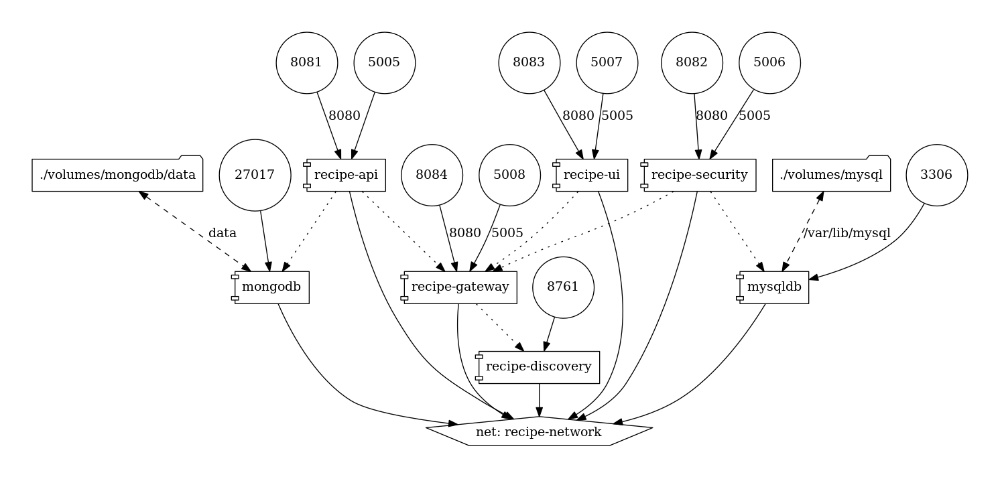

# Recipe App

This sample application is an example of Angular 7 + Spring Boot Application.

## Infrastructure view



## Technologies

* Angular 7
* Bootstrap 4
* Spring Boot 2.0
* Spring Security
* Spring Boot Netflix Zuul
* Spring Boot Netflix Eureka
* MongoDB
* MySQL
* Docker 18.06.1-ce

## recipe-api

The API default URL is:

```
http://localhost:8081/api/v1/recipe
```

There are a set of different API's, like you can see above.

##### Get all recipes

```
GET /recipes
```

##### Get recipe details

```
GET /recipe/{id}
```

##### Add new recipe

```
POST /

Payload
 
{id: integer, title: string, recipes: string}
```

#### Debug

JVM arguments for enable remote debug:

```
-agentlib:jdwp=transport=dt_socket,server=y,suspend=n,address=5005
```

Enable remote debug from your IDE on port 5005.

#### Swagger - API documentation

All REST API exposed are documented by Swagger at the below address:

http://localhost:8081/swagger-ui.html


## recipe-ui

The front-end is developed with Angular framework and the default url is:

```
http://localhost:8083
```

or in development mode, navigate to angular/ui directory and run:

```
ng serve
```
go to below url with your browser:

```
http://localhost:4200
```

## recipe-security

The service url is:

```
http://localhost:8082/api/v1/auth
```

#### Debug

JVM arguments for enable remote debug:

```
-agentlib:jdwp=transport=dt_socket,server=y,suspend=n,address=5005
```

Enable remote debug from your IDE on port 5005.

#### Swagger - API documentation

All REST API exposed are documented by Swagger at the below address:

http://localhost:8082/swagger-ui.html


## recipe-gateway

TODO


## recipe-discovery

TODO

## Networks

All containers communicate between each other through same network 'recipe-network'.

## Build

To build application run the below command:


```
mvn clean install
```

## Run

To launch application run the below command: 

```
docker-compose up
```